# Дипломный практикум в Yandex.Cloud
- [Дипломный практикум в Yandex.Cloud](#дипломный-практикум-в-yandexcloud)
  - [Цели:](#цели)
  - [Этапы выполнения:](#этапы-выполнения)
    - [Создание облачной инфраструктуры](#создание-облачной-инфраструктуры)
      - [**Результаты:**](#результаты)
    - [Создание Kubernetes кластера](#создание-kubernetes-кластера)
      - [**Результат:**](#результат)
    - [Создание тестового приложения](#создание-тестового-приложения)
      - [**Результат:**](#результат-1)
    - [Подготовка cистемы мониторинга и деплой приложения](#подготовка-cистемы-мониторинга-и-деплой-приложения)
    - [Деплой инфраструктуры в terraform pipeline](#деплой-инфраструктуры-в-terraform-pipeline)
      - [**Результат:**](#результат-2)
    - [Установка и настройка CI/CD](#установка-и-настройка-cicd)
      - [**Результат:**](#результат-3)
  - [Что необходимо для сдачи задания?](#что-необходимо-для-сдачи-задания)

**Перед началом работы над дипломным заданием изучите [Инструкция по экономии облачных ресурсов](https://github.com/netology-code/devops-materials/blob/master/cloudwork.MD).**

---
## Цели:

1. Подготовить облачную инфраструктуру на базе облачного провайдера Яндекс.Облако.
2. Запустить и сконфигурировать Kubernetes кластер.
3. Установить и настроить систему мониторинга.
4. Настроить и автоматизировать сборку тестового приложения с использованием Docker-контейнеров.
5. Настроить CI для автоматической сборки и тестирования.
6. Настроить CD для автоматического развёртывания приложения.

---
## Этапы выполнения:


### Создание облачной инфраструктуры

Для начала необходимо подготовить облачную инфраструктуру в ЯО при помощи [Terraform](https://www.terraform.io/).

Особенности выполнения:

- Бюджет купона ограничен, что следует иметь в виду при проектировании инфраструктуры и использовании ресурсов;
Для облачного k8s используйте региональный мастер(неотказоустойчивый). Для self-hosted k8s минимизируйте ресурсы ВМ и долю ЦПУ. В обоих вариантах используйте прерываемые ВМ для worker nodes.

Предварительная подготовка к установке и запуску Kubernetes кластера.

1. Создайте сервисный аккаунт, который будет в дальнейшем использоваться Terraform для работы с инфраструктурой с необходимыми и достаточными правами. Не стоит использовать права суперпользователя
2. Подготовьте [backend](https://developer.hashicorp.com/terraform/language/backend) для Terraform:  
   а. Рекомендуемый вариант: S3 bucket в созданном ЯО аккаунте(создание бакета через TF)
   б. Альтернативный вариант:  [Terraform Cloud](https://app.terraform.io/)
3. Создайте конфигурацию Terrafrom, используя созданный бакет ранее как бекенд для хранения стейт файла. Конфигурации Terraform для создания сервисного аккаунта и бакета и основной инфраструктуры следует сохранить в разных папках.
4. Создайте VPC с подсетями в разных зонах доступности.
5. Убедитесь, что теперь вы можете выполнить команды `terraform destroy` и `terraform apply` без дополнительных ручных действий.
6. В случае использования [Terraform Cloud](https://app.terraform.io/) в качестве [backend](https://developer.hashicorp.com/terraform/language/backend) убедитесь, что применение изменений успешно проходит, используя web-интерфейс Terraform cloud.

Ожидаемые результаты:

1. Terraform сконфигурирован и создание инфраструктуры посредством Terraform возможно без дополнительных ручных действий, стейт основной конфигурации сохраняется в бакете или Terraform Cloud
2. Полученная конфигурация инфраструктуры является предварительной, поэтому в ходе дальнейшего выполнения задания возможны изменения.

#### **Результаты:**

Создан сервисный аккаунт через TF, который будет в дальнейшем использоваться Terraform:

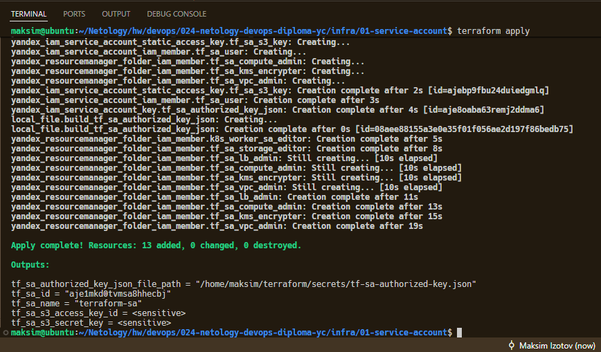

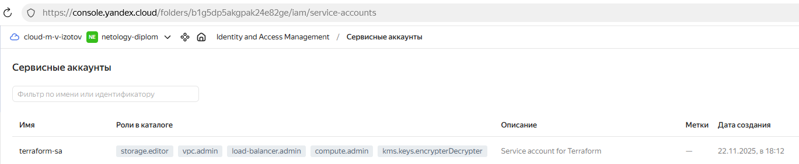

Конфигурация здесь: https://gitlab.com/netology-devops-diploma-yc/infra/-/tree/main/01-service-account

Создан S3 bucket через TF:

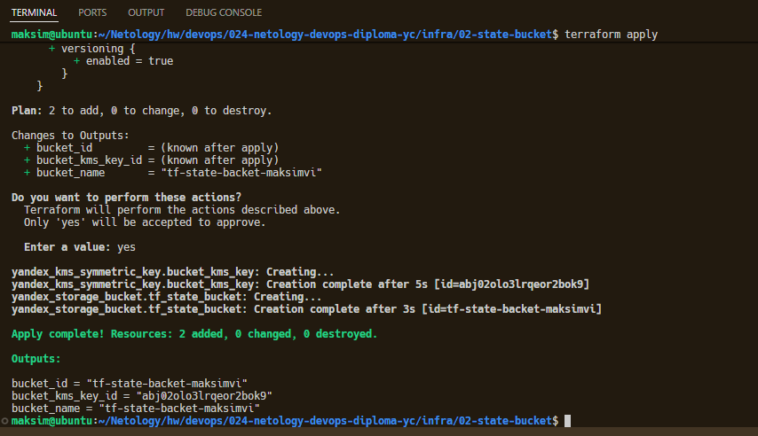

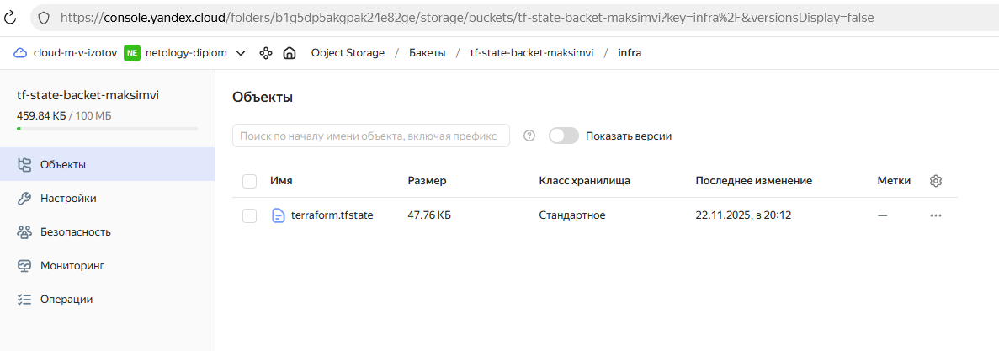

Конфигурация здесь: https://gitlab.com/netology-devops-diploma-yc/infra/-/tree/main/02-state-bucket

Экспортируем в переменные окружения ID ключа доступа, ID секоетного ключа и сервисный ключ аккаунта:

```
cd ../03-infra/
export AWS_ACCESS_KEY_ID=$(cd ../01-service-account && terraform output -raw tf_sa_s3_access_key_id)
export AWS_SECRET_ACCESS_KEY=$(cd ../01-service-account && terraform output -raw tf_sa_s3_secret_key)
export YC_SERVICE_ACCOUNT_KEY_FILE="~/terraform/secrets/tf-sa-authorized-key.json"
```

Создан VPC с подсетями в разных зонах доступности:

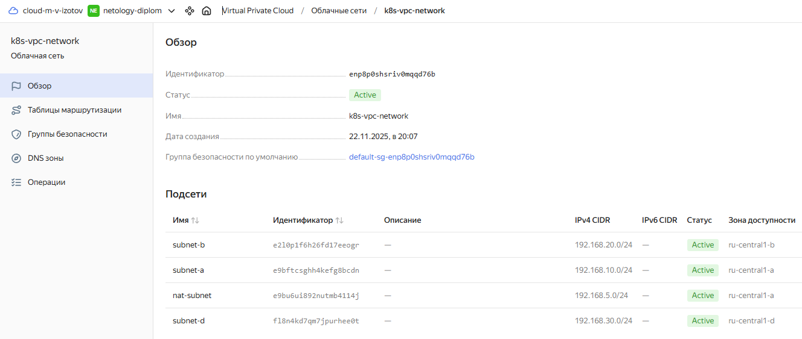

Конфигурация: https://gitlab.com/netology-devops-diploma-yc/infra/-/blob/main/03-infra

Манифест: https://gitlab.com/netology-devops-diploma-yc/infra/-/blob/main/03-infra/k8s-vpc.tf

Отрабатывает `terraform destroy` (скринщоты с готовыми ВМ из следующего этапа):

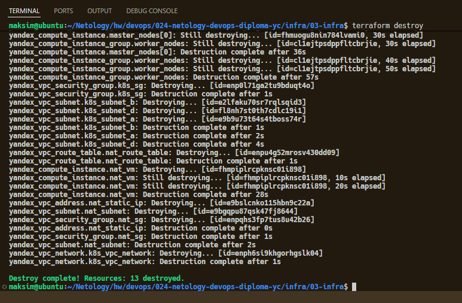

Отрабатывает `terraform apply` (скриншоты с готовыми ВМ из следующего этапа):

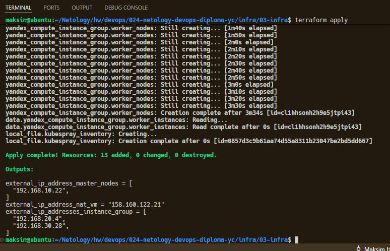

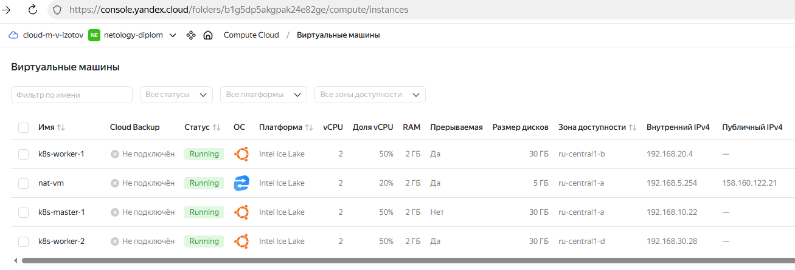


---
### Создание Kubernetes кластера

На этом этапе необходимо создать [Kubernetes](https://kubernetes.io/ru/docs/concepts/overview/what-is-kubernetes/) кластер на базе предварительно созданной инфраструктуры.   Требуется обеспечить доступ к ресурсам из Интернета.

Это можно сделать двумя способами:

1. Рекомендуемый вариант: самостоятельная установка Kubernetes кластера.  
   а. При помощи Terraform подготовить как минимум 3 виртуальных машины Compute Cloud для создания Kubernetes-кластера. Тип виртуальной машины следует выбрать самостоятельно с учётом требовании к производительности и стоимости. Если в дальнейшем поймете, что необходимо сменить тип инстанса, используйте Terraform для внесения изменений.  
   б. Подготовить [ansible](https://www.ansible.com/) конфигурации, можно воспользоваться, например [Kubespray](https://kubernetes.io/docs/setup/production-environment/tools/kubespray/)  
   в. Задеплоить Kubernetes на подготовленные ранее инстансы, в случае нехватки каких-либо ресурсов вы всегда можете создать их при помощи Terraform.
2. Альтернативный вариант: воспользуйтесь сервисом [Yandex Managed Service for Kubernetes](https://cloud.yandex.ru/services/managed-kubernetes)  
  а. С помощью terraform resource для [kubernetes](https://registry.terraform.io/providers/yandex-cloud/yandex/latest/docs/resources/kubernetes_cluster) создать **региональный** мастер kubernetes с размещением нод в разных 3 подсетях      
  б. С помощью terraform resource для [kubernetes node group](https://registry.terraform.io/providers/yandex-cloud/yandex/latest/docs/resources/kubernetes_node_group)
  
Ожидаемый результат:

1. Работоспособный Kubernetes кластер.
2. В файле `~/.kube/config` находятся данные для доступа к кластеру.
3. Команда `kubectl get pods --all-namespaces` отрабатывает без ошибок.

#### **Результат:**

Выбрал первый вариант: самостоятельная установка Kubernetes кластера.

Кластер не имеет публичных адресов находится за NAT.

Плейбук kubespray отработал:

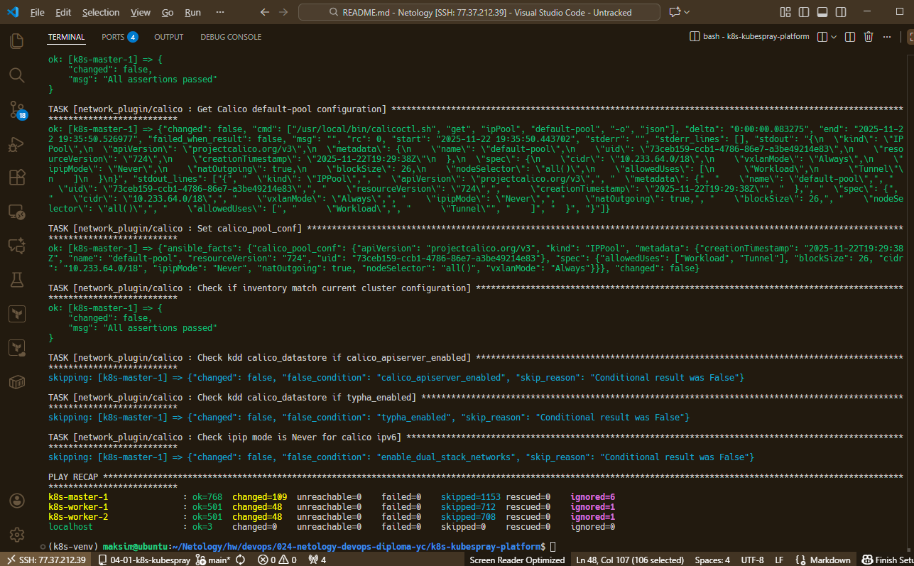

inventory/hosts.yaml сгенерированный Terraform: https://gitlab.com/netology-devops-diploma-yc/infra/-/tree/main/03-infra/kubespray-inventory

Проверяем доступность хостов:

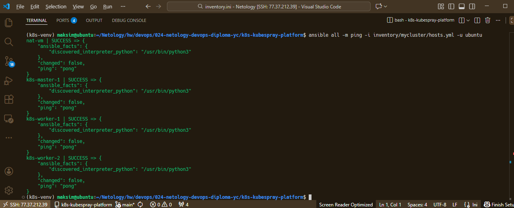

На мастер-ноде команда `kubectl get pods --all-namespaces` отрабатывает без ошибок:

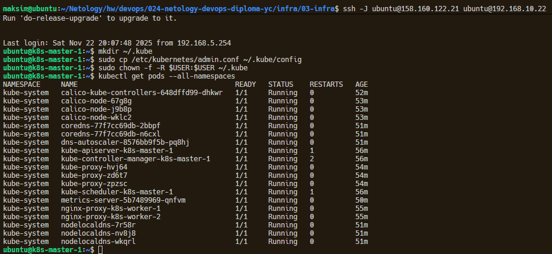

Скопирую на рабочую машину файл kubeconfig через bastion (назвал nat-vm):

```bash
scp -J ubuntu@158.160.122.21 ubuntu@192.168.10.22:~/.kube/config ~/.kube/config
```

В файле kubeconfig изменять IP-адрес сервера с локального на внешний IP-адрес нет необходимости (т.к. у мастера нет внешнего IP), создам SSH-туннель для доступа:

```bash
ssh -f -N -M -S /tmp/k8s-master-tunnel -L 6443:192.168.10.22:6443 ubuntu@158.160.122.21
```

Команда `kubectl get pods --all-namespaces` отрабатывает:

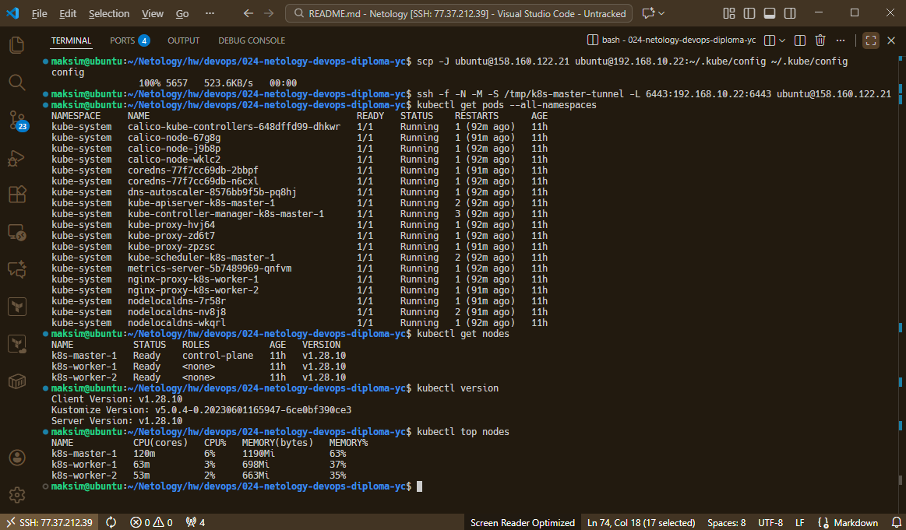

Отдельный репозиторий с подготовленной конфигурацией Kubespray:
https://gitlab.com/netology-devops-diploma-yc/k8s-kubespray

```bash
git clone https://gitlab.com/netology-devops-diploma-yc/k8s-kubespray.git k8s-kubespray-platform

# Копируем hosts.yaml сгенерированный Terraform
cp ../infra/03-infra/kubespray-inventory/hosts.yml inventory/mycluster
python3 -m venv k8s-venv
source k8s-venv/bin/activate
pip install -r requirements.txt
# Запускаем плейбук с указанием файла с переменными настроек "my_custom_settings.yml":
ansible-playbook -i inventory/mycluster/hosts.yml kubespray/cluster.yml -b -v -e "@my_custom_settings.yml"
ansible all -m ping -i inventory/mycluster/hosts.yml -u ubuntu

```

Заметки:

[Доступ к кластеру kubernetes](https://github.com/kubernetes-sigs/kubespray/blob/release-2.24/docs/setting-up-your-first-cluster.md#access-the-kubernetes-cluster)

[NAT-инстанс в роли джамп-хоста](https://yandex.cloud/ru/docs/vpc/tutorials/nat-instance/terraform#test)

---
### Создание тестового приложения

Для перехода к следующему этапу необходимо подготовить тестовое приложение, эмулирующее основное приложение разрабатываемое вашей компанией.

Способ подготовки:

1. Рекомендуемый вариант:  
   а. Создайте отдельный git репозиторий с простым nginx конфигом, который будет отдавать статические данные.  
   б. Подготовьте Dockerfile для создания образа приложения.  
2. Альтернативный вариант:  
   а. Используйте любой другой код, главное, чтобы был самостоятельно создан Dockerfile.

Ожидаемый результат:

1. Git репозиторий с тестовым приложением и Dockerfile.
2. Регистри с собранным docker image. В качестве регистри может быть DockerHub или [Yandex Container Registry](https://cloud.yandex.ru/services/container-registry), созданный также с помощью terraform.

#### **Результат:**

Git репозиторий с тестовым приложением и Dockerfile:

* https://gitlab.com/netology-devops-diploma-yc/web-app

DockerHub регистри с собранным docker image:

* https://hub.docker.com/repository/docker/maksimvi/diploma-test-app

* https://hub.docker.com/repository/docker/maksimvi/diploma-test-app/tags/1.0.0/

docker build:

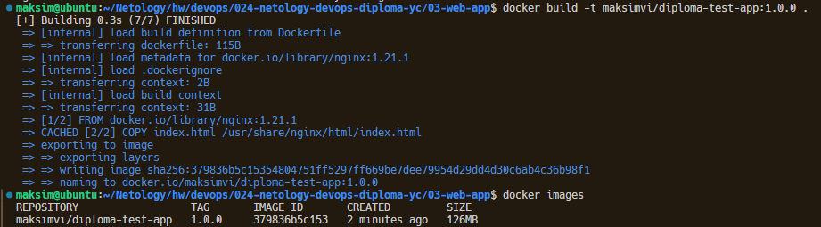

docker push:

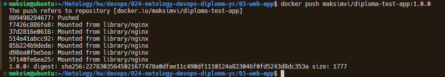

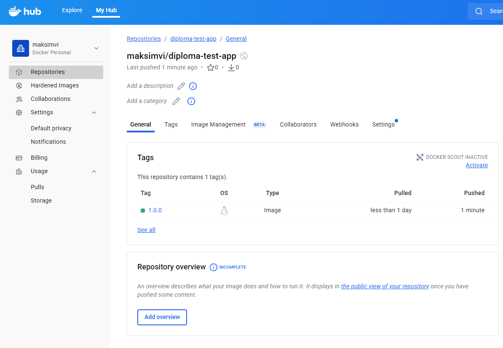


---
### Подготовка cистемы мониторинга и деплой приложения

Уже должны быть готовы конфигурации для автоматического создания облачной инфраструктуры и поднятия Kubernetes кластера.  
Теперь необходимо подготовить конфигурационные файлы для настройки нашего Kubernetes кластера.

Цель:
1. Задеплоить в кластер [prometheus](https://prometheus.io/), [grafana](https://grafana.com/), [alertmanager](https://github.com/prometheus/alertmanager), [экспортер](https://github.com/prometheus/node_exporter) основных метрик Kubernetes.
2. Задеплоить тестовое приложение, например, [nginx](https://www.nginx.com/) сервер отдающий статическую страницу.

Способ выполнения:
1. Воспользоваться пакетом [kube-prometheus](https://github.com/prometheus-operator/kube-prometheus), который уже включает в себя [Kubernetes оператор](https://operatorhub.io/) для [grafana](https://grafana.com/), [prometheus](https://prometheus.io/), [alertmanager](https://github.com/prometheus/alertmanager) и [node_exporter](https://github.com/prometheus/node_exporter). Альтернативный вариант - использовать набор helm чартов от [bitnami](https://github.com/bitnami/charts/tree/main/bitnami).

### Деплой инфраструктуры в terraform pipeline

1. Если на первом этапе вы не воспользовались [Terraform Cloud](https://app.terraform.io/), то задеплойте и настройте в кластере [atlantis](https://www.runatlantis.io/) для отслеживания изменений инфраструктуры. Альтернативный вариант 3 задания: вместо Terraform Cloud или atlantis настройте на автоматический запуск и применение конфигурации terraform из вашего git-репозитория в выбранной вами CI-CD системе при любом комите в main ветку. Предоставьте скриншоты работы пайплайна из CI/CD системы.

Ожидаемый результат:
1. Git репозиторий с конфигурационными файлами для настройки Kubernetes.
2. Http доступ на 80 порту к web интерфейсу grafana.
3. Дашборды в grafana отображающие состояние Kubernetes кластера.
4. Http доступ на 80 порту к тестовому приложению.
5. Atlantis или terraform cloud или ci/cd-terraform

#### **Результат:**

* Воспользовался пакетом [kube-prometheus-stack](https://github.com/prometheus-community/helm-charts/tree/main/charts/kube-prometheus-stack).

* Git репозиторий с конфигурационными файлами для настройки Kubernetes:

  * https://gitlab.com/netology-devops-diploma-yc/k8s-cluster-config

* Конфигурацию тестового приложения положил в репозиторий приложения:

  * https://gitlab.com/netology-devops-diploma-yc/web-app/-/tree/main/k8s

* Http доступ на 80 порту к web интерфейсу grafana:

  * http://158.160.182.29/grafana

  * Логин: admin. Пароль: Dlfkdfdl$&r3e5dlkiIrdf

* Дашборды в grafana отображающие состояние Kubernetes кластера:

  * 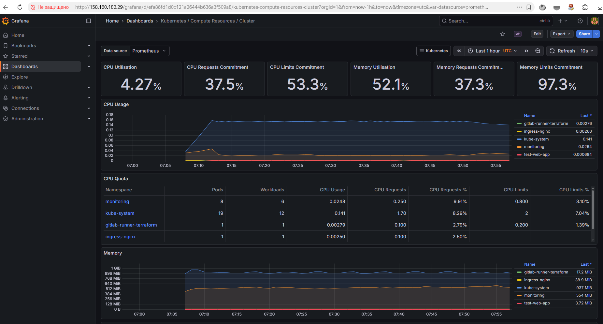

  * 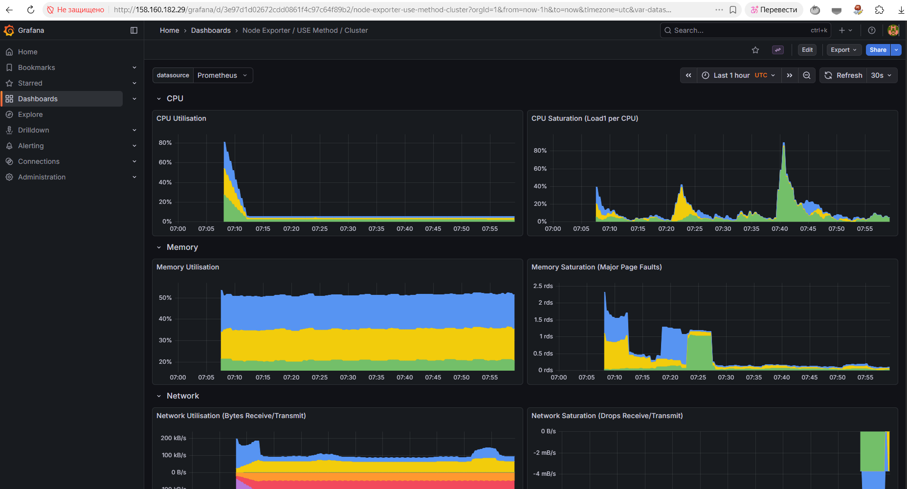

* Http доступ на 80 порту к тестовому приложению:

  * http://158.160.182.29/

* ci/cd-terraform. Предоставьте скриншоты работы пайплайна из CI/CD системы:

  * 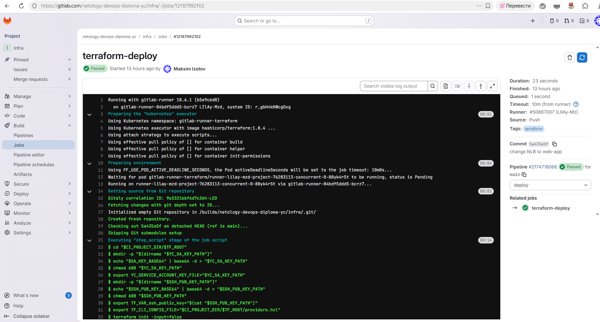

  * 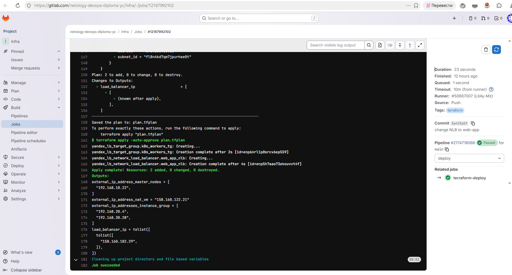

  * ссылка на пайплайн из CI/CD системы, видно всю работу: https://gitlab.com/netology-devops-diploma-yc/infra/-/jobs/12187992102

* Gitlab Runner установлен на кластере, конфиг-файл и скриншоты:

  * https://gitlab.com/netology-devops-diploma-yc/k8s-cluster-config/-/tree/main/gitlab-runner/terraform

  * 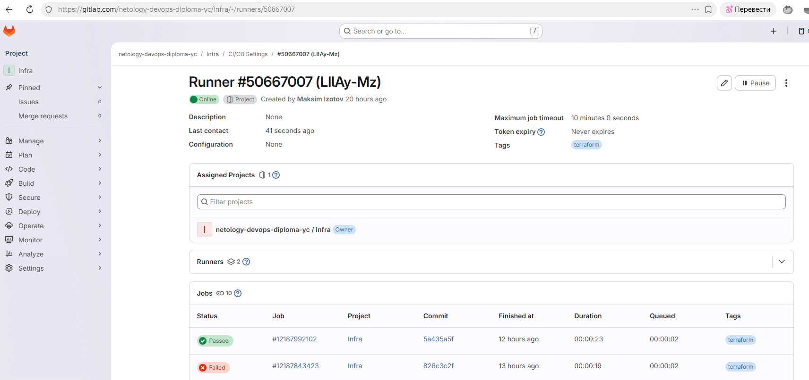

  * 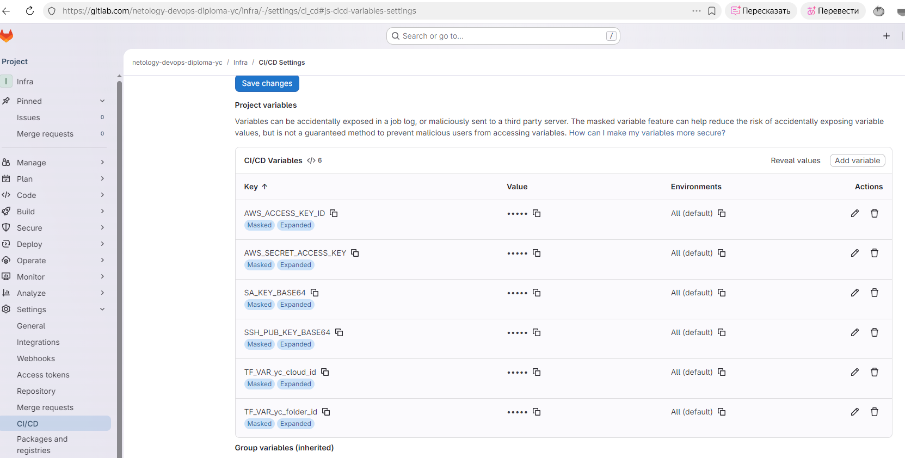

---
### Установка и настройка CI/CD

Осталось настроить ci/cd систему для автоматической сборки docker image и деплоя приложения при изменении кода.

Цель:

1. Автоматическая сборка docker образа при коммите в репозиторий с тестовым приложением.
2. Автоматический деплой нового docker образа.

Можно использовать [teamcity](https://www.jetbrains.com/ru-ru/teamcity/), [jenkins](https://www.jenkins.io/), [GitLab CI](https://about.gitlab.com/stages-devops-lifecycle/continuous-integration/) или GitHub Actions.

Ожидаемый результат:

1. Интерфейс ci/cd сервиса доступен по http.
2. При любом коммите в репозиторие с тестовым приложением происходит сборка и отправка в регистр Docker образа.
3. При создании тега (например, v1.0.0) происходит сборка и отправка с соответствующим label в регистри, а также деплой соответствующего Docker образа в кластер Kubernetes.

#### **Результат:**

* В качесте сервиса использовал GitLab.com, свой ci/cd сервис не поднимал. В кластере установил дополнительный gitlab-runner и подключил к [проекту тестового приложения](https://gitlab.com/netology-devops-diploma-yc/web-app/).

* В открытом доступе:

  * Pipelines: https://gitlab.com/netology-devops-diploma-yc/web-app/-/pipelines

  * Jobs: https://gitlab.com/netology-devops-diploma-yc/web-app/-/jobs

* Страница тестового приложения до деплоя образа с тегом v1.0.16:

  * 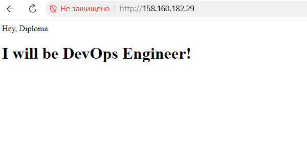

* После:

  * 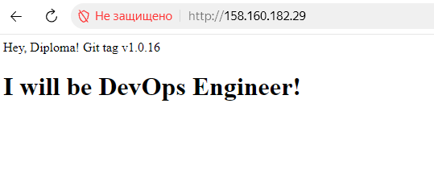

* Gitlab теги:

  * 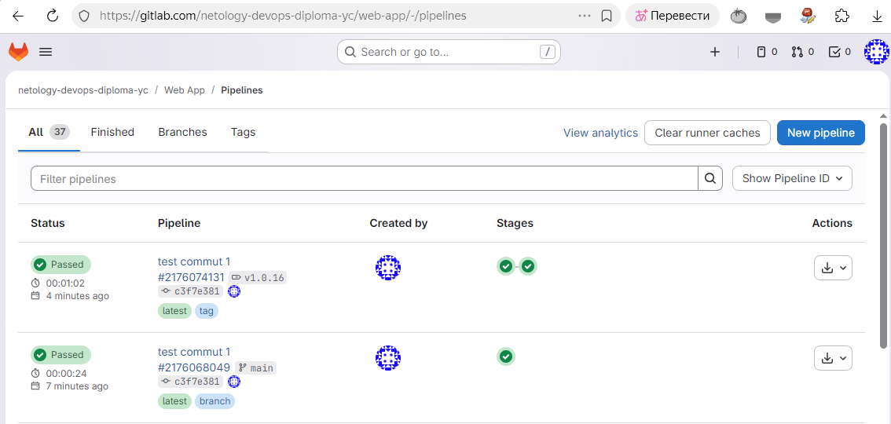

* Docker Hub теги:

  * 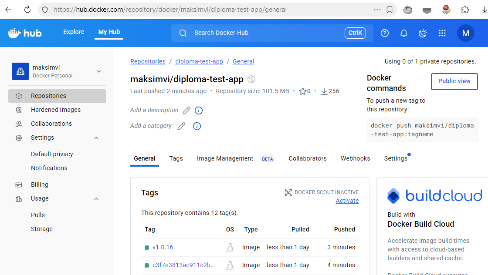

---
## Что необходимо для сдачи задания?

1. Репозиторий с конфигурационными файлами Terraform и готовность продемонстрировать создание всех ресурсов с нуля.
  
   * https://gitlab.com/netology-devops-diploma-yc/infra

2. Пример pull request с комментариями созданными atlantis'ом или снимки экрана из Terraform Cloud или вашего CI-CD-terraform pipeline.
  
   * Выше в задании приложил снимки экрана из CI-CD-terraform pipeline.
    
3. Репозиторий с конфигурацией ansible, если был выбран способ создания Kubernetes кластера при помощи ansible.
  
   * https://gitlab.com/netology-devops-diploma-yc/k8s-kubespray
    
4. Репозиторий с Dockerfile тестового приложения и ссылка на собранный docker image.
  
   * https://gitlab.com/netology-devops-diploma-yc/web-app

   * https://hub.docker.com/repository/docker/maksimvi/diploma-test-app/tags/1.0.0/
    
5. Репозиторий с конфигурацией Kubernetes кластера.
  
   * https://gitlab.com/netology-devops-diploma-yc/k8s-cluster-config
    
6. Ссылка на тестовое приложение и веб интерфейс Grafana с данными доступа.
  
   * http://158.160.182.29/

   * http://158.160.182.29/grafana Логин: admin. Пароль: Dlfkdfdl$&r3e5dlkiIrdf
    
7. Все репозитории рекомендуется хранить на одном ресурсе (github, gitlab)

